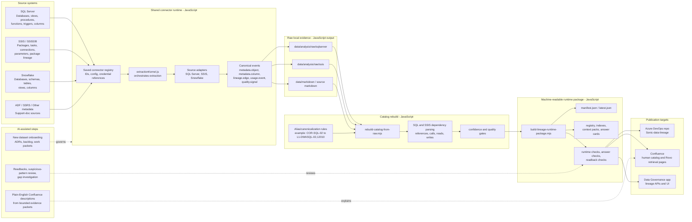

# Data Lineage Extract Process Technical Overview

## Purpose

This document explains how the Sonic data lineage extraction process works, what
is deterministic JavaScript, and where AI is used.

The important meeting message:

```text
JavaScript is the lineage engine. AI is active during onboarding, review, and
documentation, but AI does not invent lineage edges or replace the deterministic
extract/build/validation steps.
```

## Executive Summary

The lineage process has six main layers:

1. Connect to approved source systems through saved connectors.
2. Extract metadata and source-defined dependencies with JavaScript extractors.
3. Normalize everything into a canonical object and lineage model.
4. Use AI to plan onboarding, inspect evidence gaps, and prepare bounded
   human-readable descriptions from generated artifacts.
5. Build machine-readable runtime packages and human-readable documentation.
6. Validate, sync, and publish only after checks pass.

The process supports SQL Server, SSIS, Snowflake, and supporting documentation
outputs such as Confluence and Azure DevOps lineage artifacts.

## Architecture Diagram

Static picture version:

```text
docs/assets/lineage-extract-architecture.svg
docs/assets/lineage-extract-architecture.png
```



## What JavaScript Does

JavaScript performs the deterministic lineage work.

### Connector And Extraction Runtime

The shared connector runtime owns source access and extraction orchestration.

Key implementation:

- `src/services/connectorRuntime/extractionKernel.js`
- `src/services/connectorService.js`
- source adapters used by SQL Server, SSIS, and Snowflake workflows

The runtime:

- loads saved connector config and credential references;
- opens source-specific adapters;
- runs approved metadata streams;
- emits normalized metadata events;
- returns structured errors with phase and remediation.

The connector framework is documented in:

- `docs/CONNECTOR_EXTRACTION_FRAMEWORK.md`
- `docs/CONNECTOR_METADATA_PROFILE_FRAMEWORK.md`

### SQL Server Incremental Ingestion

Command:

```powershell
npm run sqlserver:lineage:ingest
```

Script:

```text
scripts/ingest-sqlserver-lineage-incremental.mjs
```

What it does:

- runs SQL Server metadata streams through the shared connector runtime;
- extracts schemas, tables, views, columns, procedures, functions, triggers, and
  relationships;
- normalizes object identity into server/database/schema/object;
- creates source markdown and context packs;
- computes metadata signatures;
- compares against the DevOps object registry as the master machine-readable
  baseline;
- writes only new or changed artifacts by default;
- supports `--full-refresh` when a full rewrite is intentionally required.

### SSIS Incremental Ingestion

Command:

```powershell
npm run ssis:lineage:ingest
```

Script:

```text
scripts/ingest-ssis-lineage-incremental.mjs
```

What it does:

- runs SSIS metadata streams through the shared connector runtime;
- extracts catalog, packages, tasks, connections, parameters, environments,
  agent jobs, and lineage;
- creates package identity and context packs;
- compares package metadata signatures to the DevOps registry;
- writes only new or changed package artifacts by default;
- supports `--full-refresh` for a deliberate complete refresh.

### Snowflake Metadata Ingestion

Command:

```powershell
npm run snowflake:lineage:ingest
```

Script:

```text
scripts/ingest-snowflake-lineage-slice.mjs
```

What it does:

- connects with the saved Snowflake connector;
- harvests database, schema, table, view, and column metadata;
- skips Snowflake internal/sample databases unless explicitly included;
- normalizes Snowflake objects into the same registry shape as SQL Server and
  SSIS;
- computes object signatures;
- writes only changed objects by default;
- updates registry, database indexes, object path indexes, context packs, and
  catalog manifest.

### Catalog Rebuild

Command:

```powershell
npm run catalog:rebuild
```

Script:

```text
scripts/rebuild-catalog-from-raw.mjs
```

What it does:

- reads raw SQL Server and SSIS metadata;
- parses SQL and SSIS dependency evidence;
- canonicalizes server/database identity;
- applies alias rules such as `COR-SQL-02` to
  `L1-DWASQL-02,12010`;
- resolves references into canonical object IDs where possible;
- classifies lineage edges as reads, writes, lookups, calls, and unresolved
  references;
- scores confidence and writes rebuild reports;
- enforces quality gates when `--enforce-gates` is used.

### Runtime Package Build

Commands:

```powershell
npm run lineage:runtime:package
npm run lineage:runtime:check
npm run lineage:answers:check
npm run lineage:runtime:readback
```

Scripts:

```text
scripts/build-lineage-runtime-package.mjs
scripts/check-lineage-runtime-package.mjs
scripts/check-lineage-answer-quality.mjs
scripts/check-lineage-runtime-readback.mjs
```

What they do:

- assemble the approved runtime package under
  `data/lineage-runtime-package/sonic-data-lineage-runtime`;
- create `manifest.json`, `latest.json`, registry files, indexes, context packs,
  and answer-card artifacts;
- compute a runtime content hash;
- validate path contracts so consumers do not guess paths;
- validate lineage answers against expected object and dependency behavior.

Runtime package rules are documented in:

- `docs/LINEAGE_RUNTIME_PACKAGE_MANIFEST_CONTRACT.md`
- `docs/LINEAGE_RUNTIME_READBACK_PROCESS.md`

### DevOps Repo Sync

Command:

```powershell
npm run lineage:runtime:sync
```

Script:

```text
scripts/sync-lineage-runtime-to-catalog-repo.mjs
```

What it does:

- copies approved runtime package artifacts into the separate
  `Sonic-data-lineage` Azure DevOps repository;
- writes a sync summary;
- refuses to sync outside the expected target repo;
- preserves the DevOps repo as the computer-friendly master record.

### Confluence Publishing

Representative commands:

```powershell
npm run confluence:human:publish
npm run confluence:rovo:publish
```

What they do:

- build human-readable catalog pages;
- build Rovo AI retrieval pages;
- publish only reviewed page packets;
- keep Confluence as the human documentation and navigation layer, not the
  machine-readable source of truth.

## What AI Does During New Dataset Onboarding

AI is not the parser, extractor, or runtime lineage engine.

AI is active in the onboarding process, but it is bounded by generated evidence.
For a new database or dataset, AI can help decide what needs to be run, interpret
what came back, identify suspicious gaps, and draft human-facing descriptions.
The facts must still come from the connector runtime, catalog rebuild, runtime
package, and validation readbacks.

| Area                    | AI role                                                                                                        | Deterministic source                                       |
| ----------------------- | -------------------------------------------------------------------------------------------------------------- | ---------------------------------------------------------- |
| New dataset onboarding  | Build ADRs, backlog, work packets, execution packets, and operator checklists                                  | Repo docs, connector scope, user-approved source list      |
| Extraction supervision  | Choose the correct low-risk command sequence and confirm whether the run should be incremental or full refresh | Existing npm commands, connector contracts, execution logs |
| Investigation           | Inspect lineage outputs and identify suspicious gaps or patterns                                               | Runtime package, raw metadata, readback files              |
| Confluence descriptions | Draft plain-English page descriptions from bounded evidence packets                                            | Generated manifests, context packs, profiles, markdown     |
| Quality review          | Compare expected behavior to generated evidence                                                                | Validation scripts and readback artifacts                  |
| Meeting support         | Summarize architecture and process                                                                             | Existing repo docs and JavaScript command flow             |

### AI In Confluence Page Creation

AI can be used to create or improve plain-English text on Confluence pages, but
only from bounded evidence. That means AI may summarize:

- what kind of object a table/view/procedure/package is;
- what known upstream and downstream objects are present in the runtime package;
- what confidence, profile, and missing-fact signals exist;
- what a support user should check first.

AI must label unsupported facts as not surfaced in metadata. It must not infer
owner, steward, business certification, freshness, or business purpose from weak
signals such as an object name alone.

Confluence publication itself is still JavaScript-driven. AI may help write or
review the page content, but the publish packet, page tree, labels, links, and
sync are generated and executed by scripts.

AI must not:

- invent source tables or lineage edges;
- bypass connector access controls;
- publish secrets, credentials, raw row data, or unrestricted samples;
- make Confluence the source of truth;
- skip validation gates because an answer sounds plausible.

## New Dataset Onboarding: Who Does What

| Onboarding step        | JavaScript/scripts                                                          | AI                                                                 |
| ---------------------- | --------------------------------------------------------------------------- | ------------------------------------------------------------------ |
| Define source scope    | Uses connector id, database/schema filters, and approved command options    | Helps write the ADR, backlog, and execution packet                 |
| Test connector         | Runs shared connector test/runtime code                                     | Interprets failure messages and suggests next checks               |
| Extract metadata       | Pulls tables, views, columns, procedures, packages, and source dependencies | Does not extract the metadata                                      |
| Build lineage edges    | Parses SQL/SSIS/source evidence and resolves references                     | Reviews suspicious gaps and asks for targeted traces               |
| Incremental comparison | Computes signatures and compares to the DevOps registry                     | Helps decide whether a full refresh is justified                   |
| Runtime package        | Builds manifests, indexes, context packs, answer cards, and hashes          | Reviews readback and explains whether outputs look credible        |
| Confluence pages       | Generates page packets and publishes reviewed pages                         | Drafts or refines plain-English descriptions from bounded evidence |
| Final approval         | Runs checks and readbacks                                                   | Summarizes risks and open questions for humans                     |

## Incremental Refresh Model

The default ingest behavior is incremental.

The scripts compute signatures from normalized metadata and compare those
signatures to the existing machine-readable registry.

Default behavior:

- new object: write object artifacts;
- changed object: rewrite affected artifacts;
- unchanged object: leave artifacts alone;
- stale objects: retained unless a deliberate `--full-refresh` is approved.

Full refresh behavior:

- intended for first baseline builds or explicit corrective refreshes;
- can remove or rewrite a full source slice;
- should be separately approved because it has a wider blast radius.

This is why SQL Server, SSIS, and Snowflake ingestion can refresh only new or
changed metadata unless the user explicitly requests a full refresh.

## Important Command Sequences

### Targeted COR-SQL Alias Repair

Used when lineage is correct in SQL text but server identity prevents the graph
from resolving across databases.

```powershell
npm run lineage:cor-sql:packet
npm run lineage:cor-sql:refresh
npm run catalog:rebuild
npm run lineage:runtime:package
npm run lineage:runtime:check
npm run lineage:answers:check
npm run lineage:runtime:readback
npm run lineage:runtime:sync
```

Documented in:

```text
docs/LINKED_SERVER_ALIAS_LINEAGE_REFRESH_PROCESS.md
```

### Standard Runtime Package Refresh

```powershell
npm run catalog:refresh:fast
npm run lineage:runtime:package
npm run lineage:runtime:check
npm run lineage:answers:check
npm run lineage:runtime:sync
```

### Full Human Catalog Publish

Human catalog publication is separate from runtime package sync.

Representative flow:

```powershell
npm run confluence:human:dry-run
npm run confluence:human:check
npm run confluence:human:publish
```

Live Confluence publish should be reviewed as a publish packet, especially for
large catalog slices.

## Evidence And Outputs

| Output                                                    | Purpose                                     |
| --------------------------------------------------------- | ------------------------------------------- |
| `data/analysis/raw/sqlserver`                             | Raw SQL Server metadata evidence            |
| `data/analysis/raw/ssis`                                  | Raw SSIS metadata and package evidence      |
| `data/markdown`                                           | Local generated markdown catalog            |
| `data/markdown/rebuild-report.md`                         | Catalog rebuild summary and quality signals |
| `data/lineage-runtime-package/sonic-data-lineage-runtime` | Local runtime package build                 |
| `../Sonic-data-lineage`                                   | DevOps machine-readable master repo         |
| Confluence `Sonic Data Lineage`                           | Human catalog and Rovo retrieval pages      |

## Controls And Guardrails

The process has several safety controls:

- source connectors store credential references, not raw secrets in docs;
- extraction is metadata-focused, not row-data harvesting;
- raw values and unrestricted samples are not part of lineage publication;
- Confluence publishing is separate from machine-readable runtime sync;
- runtime package manifests include counts, hashes, and path contracts;
- checks validate package paths and answer behavior;
- incremental ingest avoids rewriting the full catalog unless approved;
- alias handling is explicit and documented, not guessed at answer time.

## How To Explain The AI Boundary In The Meeting

Use this wording if asked:

```text
The lineage engine is deterministic JavaScript. It extracts source metadata,
parses dependencies, normalizes object identity, computes signatures, builds the
runtime package, and runs validation checks. AI is active during onboarding:
it writes ADRs and work packets, reviews readback evidence, highlights suspicious
patterns, and drafts plain-English Confluence descriptions from bounded
artifacts. AI is not the source of truth for lineage facts.
```

## Current Maturity

Current strengths:

- source-specific extraction runs through a shared connector model;
- incremental refresh is implemented for SQL Server, SSIS, and Snowflake;
- DevOps runtime package is treated as the machine-readable master record;
- Confluence is separated into human navigation and Rovo retrieval artifacts;
- targeted refresh patterns exist for known alias issues such as `COR-SQL-02`.

Current known limitations:

- source-specific edge quality depends on the metadata available from each
  source system;
- SQL text and SSIS packages can contain dynamic SQL or indirect references that
  need review;
- alias and synonym handling must be maintained when infrastructure names
  change;
- full-catalog Confluence publication should remain packet-reviewed because it
  affects a broad user-facing tree.
